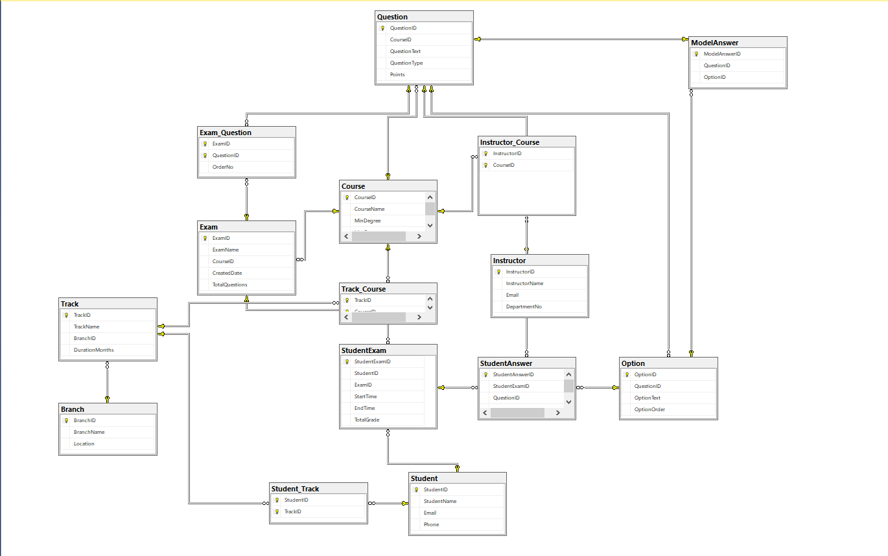

# ITI Student Exam System

SQL Server database schema + stored procedures, plus a JavaFX Desktop client (OOP controllers) for managing branches/tracks/courses/students/instructors/exams and viewing reports.

## Contents

- [ERD](#erd)
- [Database Setup](#database-setup)
- [Desktop Client](#desktop-client)
- [Roles & Logins](#roles--logins)
- [Sample Data](#sample-data)
- [Project Structure](#project-structure)

## ERD

## Database Setup

### Prerequisites

- Microsoft SQL Server
- SSMS / Azure Data Studio (or any SQL client that can run `.sql` scripts)

### Recommended script order

Run scripts from the [Database/](Database/) folder in this order:

1. Schema (creates `ITI_ExaminationDB` and all tables)
   - [CreateDbTables.sql](Database/CreateDbTables.sql)
2. CRUD stored procedures
   - [BranchCRUD_SP.sql](Database/BranchCRUD_SP.sql)
   - [TrackCRUD_sp.sql](Database/TrackCRUD_sp.sql)
   - [CourseCRUD_sp.sql](Database/CourseCRUD_sp.sql)
3. Exam + question bank + submission/correction + extra CRUD
   - [ExamCRUD_SP.sql](Database/ExamCRUD_SP.sql)
4. Reports (separated)
   - [REPORTS_SP.sql](Database/REPORTS_SP.sql)
5. Users / roles / permissions (safe to re-run)
   - [UserRoles&Enviroment.sql](Database/UserRoles&Enviroment.sql)
6. Seed data
   - [sample-data.sql](Database/sample-data.sql)
7. Extra seed data (exams + grades)
   - [sample-exams-and-grades.sql](Database/sample-exams-and-grades.sql)
8. Utilities (optional)
   - Randomly assign students without any track:
     - [assign-students-to-tracks-random.sql](Database/assign-students-to-tracks-random.sql)
   - Select students with track info (used by DesktopClient Students tab):
     - [SelectStudentWithTrack_SP.sql](Database/SelectStudentWithTrack_SP.sql)

Notes:
- Some procedures exist in multiple files (e.g., reports). If you get “already exists”, use `CREATE OR ALTER` or run only one definition.
- The [Backup/](Backup/) folder contains `.bak` database backups for restoring in SQL Server.

## Desktop Client

### Tech

- Java (JDK 25 recommended)
- JavaFX (Windows jars are included under `DesktopClient/lib/javafx/`)
- Microsoft SQL Server JDBC driver (`DesktopClient/lib/mssql-jdbc-12.6.1.jre8.jar`)

### Run (Windows)

Use the batch script in repo root:

- [run-desktopclient.bat](run-desktopclient.bat)

It compiles `DesktopClient/src/Main.java` into `DesktopClient/out` and launches the JavaFX app.

### App features (tabs)

- Branches / Tracks / Courses
- Students (Admin only)
- Instructors (Admin only)
- Exams (Admin + Instructor)
- Reports (all roles; Student role sees only “Student Grades”)
- Procedures (Admin + Instructor)

## Roles & Logins

The [UserRoles&Enviroment.sql](Database/UserRoles&Enviroment.sql) script creates SQL logins/users and grants permissions for role-based login in the DesktopClient:

- Admin
  - Login: `ExamAdmin`
  - Password: `Admin@123`
  - DB role: `db_owner`
- Instructor
  - Login: `InstructorUser`
  - Password: `Instructor@123`
  - Permissions: read + execute needed stored procedures + write on exam/question tables
- Student
  - Login: `StudentUser`
  - Password: `Student@123`
  - Permissions: read + execute `SubmitExamAnswers` and `Report_StudentGrades` (and limited selects)

## Sample Data

- [sample-data.sql](Database/sample-data.sql)
  - branches, tracks, courses, instructors, students, track-course mapping, student-track mapping, questions, options, model answers
- [sample-exams-and-grades.sql](Database/sample-exams-and-grades.sql)
  - two sample exams + sample grades in `StudentExam` (+ a few sample answers)

## Project Structure

- `Database/` – schema, stored procedures, seed data, utilities
- `DesktopClient/` – JavaFX Desktop app (OOP controllers calling stored procedures)
  - `src/` – Java sources
  - `lib/` – JDBC + JavaFX jars
- `Backup/` – SQL Server `.bak` backups
- `ERD/` – ERD diagrams
- `ITI_Exam_System_SRS_v3.pdf` – requirements/specification
- [run-desktopclient.bat](run-desktopclient.bat) – compile+run DesktopClient on Windows

